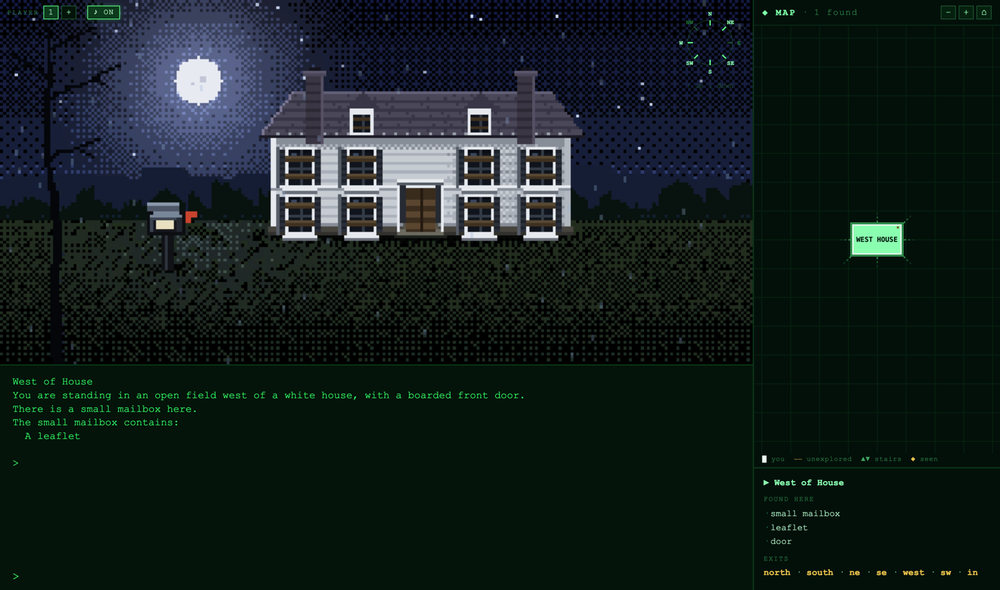
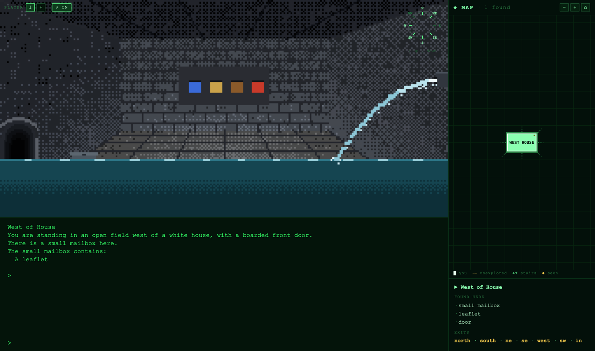
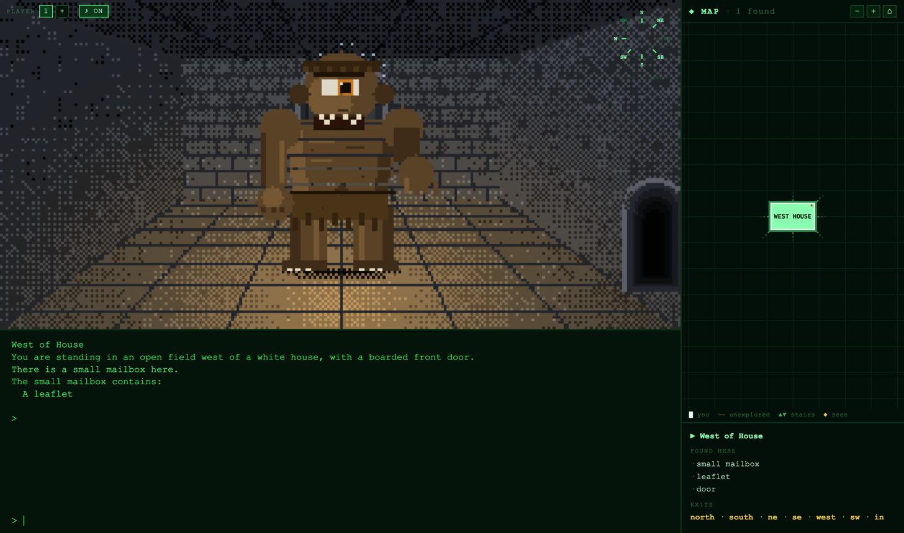
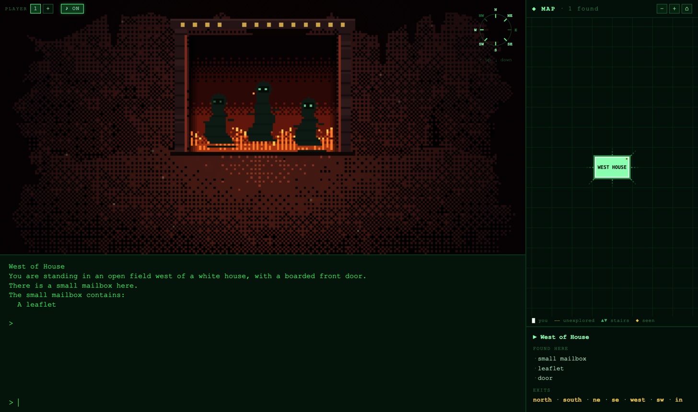
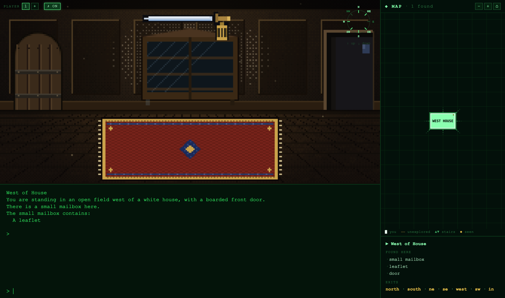
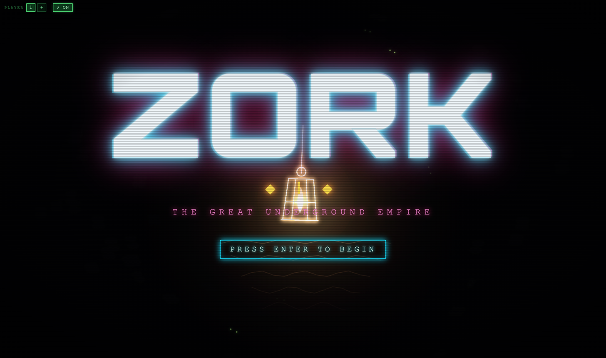

# ZORK UI

> *West of House. You are standing in an open field west of a white house, with a boarded front door.*
>
> **Zork I (1980), replayed through a CRT** — the complete, unmodified original game, wrapped in 110 hand-crafted animated pixel-art scenes that watch what you do and change with the world.



**Play it:** https://zork-ui-production.up.railway.app

## What this is

The real Zork I story file runs in your browser on a genuine Z-machine interpreter — every puzzle, every death, every grue exactly as Infocom shipped it in 1980. Around that terminal, this project adds what 1980 couldn't:

- **110 hand-crafted pixel-art scenes**, one per room — rendered live in code on a 256-pixel canvas buffer and upscaled hard, Daggerfall/SCUMM style. No image assets anywhere: every moonlit field, burning gate and drowned temple is drawn pixel-by-pixel every frame, and every scene is animated (rain, fireflies, torch flicker, drifting mist).
- **Scenes that track the actual game state.** The renderer reads the Z-machine's live object tree, so the brown sack sits on the kitchen table until you take it — and vanishes from the painting when the thief takes it from *you*.
- **A generative soundtrack** synthesized from nothing: no audio files, just WebAudio drones, drips and wind that crossfade per region — with a heartbeat when you're in the dark where the grue waits.
- **The adventurer's map**: a Trizbort-style auto-map that draws itself as you explore, direction-true, floor by floor, quietly underlining every exit you haven't tried.
- **Clues in the narrator's voice** — `clue` gives a spoiler-light nudge specific to the room you're in, for every treasure and every hard puzzle.

## The world reacts

Open the mailbox and the little door swings up. Kill the troll and his corpse stops blocking the hall. Feed the cyclops and he slumps snoring against the wall. Press the wrong button in the maintenance room and a pipe bursts — the water rising in the art, turn by turn, exactly as fast as the game says it is.

| The blue button was not your friend | The cyclops, considering you as food |
| --- | --- |
|  |  |

| The gates of Hades | The living room, before the rug moved |
| --- | --- |
|  |  |

More than thirty of these interactive states are wired to the game's own text: the rug and the trap door, the dam's sluice gates, the drained reservoir, the rope tied to the dome railing, the rainbow turned solid, the exorcised spirits, the thief glimpsed mid-burglary striding through your room…



## The clues

Type `clue` anywhere. Instead of a walkthrough, you get the narrator:

> *Hear the trap door slam? Someone down here doesn't like visitors using it. There are other ways back to the surface — find them, and one day the door will stay open.*

> *Four buttons: one wakes the dam controls, one toggles the lights, and one bursts a pipe and floods the room to your neck. The YELLOW one is your friend. The blue one is not.*

> *Most mirrors show you where you are. This one is more interested in where you aren't. Touch it.*

## How it works

- **Z-machine:** [ifvms.js](https://github.com/curiousdannii/ifvms.js) runs the original `zork1.z3` byte-for-byte; [GlkOte](https://eblong.com/zarf/glk/glkote.html) handles the I/O plumbing.
- **World introspection:** the renderer reads Z-machine memory directly — the object tree, decoded short names, light state — and maps live objects to the rooms' props. No forked game logic; the story file stays the single source of truth.
- **Scenes:** TypeScript canvas code. One draw function per room family, a 256px offscreen buffer, nearest-neighbour upscale, ordered Bayer dithering, tight committed palettes. Everything animates on the pixel grid.
- **Audio:** a small WebAudio engine — oscillator drones with octave partials, filtered noise beds, one-shot blips — driven by room-family moods and game flags.
- **Persistence:** autosaves into localStorage with multiple player slots; the map, scene states and world flags survive death (as is traditional).
- **Mobile:** responsive layout — scene stacked over terminal, the map as a full-screen slide-in, touch pan/pinch on the map.

## Run it locally

```sh
npm install
npm run dev        # vite, http://localhost:5174
```

Build and serve like production:

```sh
npm run build
npm start          # node server.js — serves dist/ on $PORT
```

## Credits

- **Zork I** was created by Tim Anderson, Marc Blank, Bruce Daniels and Dave Lebling at Infocom, 1980. The game's source and story file were released under the MIT license (see `ZORK_LICENSE`) in the 2025 Microsoft/Xbox historical release.
- Z-machine interpreter: [ifvms.js](https://github.com/curiousdannii/ifvms.js) by Dannii Willis. Glk layer: [GlkOte](https://eblong.com/zarf/glk/glkote.html) by Andrew Plotkin.
- Scenes, map, ambience and everything green-on-black: built by [Cedric Dugas](https://github.com/posabsolute) with Claude Code.

*It is pitch black. You are likely to be eaten by a grue.*
